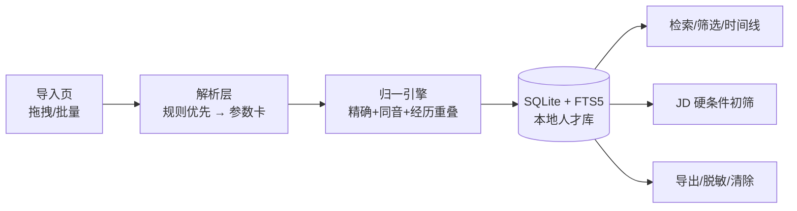
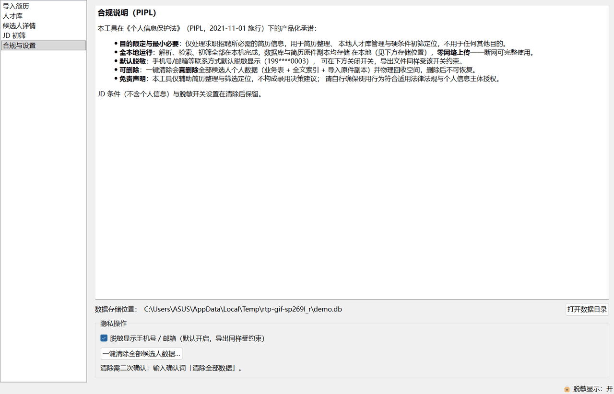

# resume-talent-pool

> 🚧 项目进行中：v0.1.0（M0 骨架 ✅ / M1 合成数据先行 ✅ / M2 解析层 ✅ / M3 归一与人才库 ✅ / M4 内置基准 ✅ / **M5 桌面交付 ✅**），功能随里程碑点亮（[计划总览](plan/00-README总览.md)）。

**简历解析与人才库管理桌面应用**（Windows，本地优先）：简历批量导入解析 → 本地人才库管理与检索 → 同一候选人多版本简历识别与合并 → JD 硬条件初筛 → 导出。全流程本地运行、零网络上传，把《个人信息保护法》（PIPL，2021-11-01 施行）的合规要求做成可演示的产品功能（默认脱敏显示、一键清除、合规说明页）。

> 免责声明：本工具仅辅助简历整理与筛选定位，不构成录用决策建议。

## 特性（规划，随里程碑点亮）

| 特性 | 状态 |
|---|---|
| 批量导入解析（PDF/docx/txt → 候选人参数卡：字段+置信度+证据） | ✅ M2 |
| 本地人才库：SQLite + FTS5 全文检索、多维筛选、标签体系 | ✅ M3（CLI `import`/`search` 已点亮） |
| 同一候选人识别与合并（精确键+同音+经历重叠评分，冲突待人工确认） | ✅ M3（M4 全量基准收口，误合并率 0） |
| 时间线视图：多版本简历经历演变（自绘色带 + 版本切换 + 冲突确认面板） | ✅ M5 |
| JD 硬条件初筛：学历/年限/必备技能/排除项 → 三态命中矩阵+匹配分排序+CSV 导出（纯规则离线；CLI `screen` 与 GUI 初筛页共用同一纯函数） | ✅ M5 |
| 隐私合规：默认脱敏显示（settings 开关，显示/导出同约束）、一键清除（确认词二次确认，真删除+VACUUM+删原件）、PIPL 合规页（启动首页） | ✅ M5 |
| 内置评测基准：合成简历生成器（固定 seed 带真值）+ 解析/归一指标表 | ✅ M1–M4（`bench gen`/`bench parse`/`bench match`） |
| PySide6 桌面应用（导入/人才库/详情/初筛/合规五页）+ PyInstaller 打包 exe（onedir+zip） | ✅ M5（exe 冒烟通过） |

## 架构



详细设计见 [plan/03-架构与技术选型.md](plan/03-架构与技术选型.md)、[plan/04-模块详设.md](plan/04-模块详设.md)。

## 快速开始（开发态）

```bash
py -m pip install -U pip
pip install -e ".[dev,parse,gen]"
pytest
resume-talent-pool --version
```

- Python ≥ 3.8（开发机 3.8.8）；桌面应用需 GUI extras：`pip install -e ".[dev,parse,gui]"`，运行 `py -m resume_talent_pool.cli gui`。
- 依赖分组见 `pyproject.toml`：`parse`/`gen`/`gui`/`report`/`llm`/`dev`/`pkg`（PyInstaller）。

## 内置评测基准

合成简历集（固定 seed=20261005，100 人/178 份，PDF/docx/txt ≈ 4:4:2）带逐文件真值；
基准全程零 API 依赖（纯规则通路），固定输入两次运行指标逐字节一致。复现：

```bash
pip install -e ".[dev,parse,gen]"
py -m resume_talent_pool.cli bench gen --seed 20261005   # 生成 output/（不入仓）
py -m resume_talent_pool.cli bench parse --data output   # 字段解析基准（门槛 0.95）
py -m resume_talent_pool.cli bench match --data output   # 归一基准（门槛 P/R≥0.95 + 误合并率 0）
```

**字段解析基准（全量 178 份，宏平均 F1 = 1.0000）**

| 字段 | P | R | F1 | TP | FP | FN |
|---|---|---|---|---|---|---|
| name | 1.0000 | 1.0000 | 1.0000 | 178 | 0 | 0 |
| phone | 1.0000 | 1.0000 | 1.0000 | 159 | 0 | 0 |
| email | 1.0000 | 1.0000 | 1.0000 | 156 | 0 | 0 |
| degree | 1.0000 | 1.0000 | 1.0000 | 166 | 0 | 0 |
| school | 1.0000 | 1.0000 | 1.0000 | 162 | 0 | 0 |
| major | 1.0000 | 1.0000 | 1.0000 | 152 | 0 | 0 |
| graduation_date | 1.0000 | 1.0000 | 1.0000 | 127 | 0 | 0 |
| desired_position | 1.0000 | 1.0000 | 1.0000 | 131 | 0 | 0 |
| experiences | 1.0000 | 1.0000 | 1.0000 | 434 | 0 | 0 |
| skills | 1.0000 | 1.0000 | 1.0000 | 1420 | 0 | 0 |
| certificates | 1.0000 | 1.0000 | 1.0000 | 379 | 0 | 0 |

真值缺失字段被预测出来计 FP（防"蒙"刷分）；技能/证书为集合语义多重集比对。

**同一人识别基准（全量 178 份 / 100 真值组，门槛 P/R ≥ 0.95 + 误合并率 = 0）**

| 指标 | 值 |
|---|---|
| 真值组 → 预测聚类 | 100 → 104 |
| 真值同类对 / 预测合并对 | 96 / 92 |
| TP / FP / FN | 92 / 0 / 4 |
| 精确率 P | 1.0000 |
| 召回率 R | 0.9583 |
| 聚类 F1 | 0.9787 |
| **误合并率（硬门槛）** | **0.0000** |

- 对账口径：预测侧纯函数聚类（键1 精确 → 键2 同音 → 键3 经历重叠评分，auto_merge
  并簇、并查集传递闭包）；真值侧 = 文件 → 虚拟人 → 同人组（同名不同人组为反例，
  over-rule 强制拆分）。
- 4 对未自动合并的同人多版本简历均落在 0.6≤S<0.85 **待人工确认档**（联系方式更换/
  缺失且经历追加演进），产品语义即"不自动合并、进人工队列"，不计为错误；9 对待确认
  对全部同类、零跨组。

## CLI 速查（screen / purge）

```bash
# JD 初筛：三态命中矩阵（✓满足 ✗不满足 ?待人工确认）+ 匹配分排序，可导出 CSV
py -m resume_talent_pool.cli import data/samples/resumes --db talent.db
py -m resume_talent_pool.cli screen --jd jd.json --db talent.db --export 初筛结果.csv

# 一键清除（真删除，需输入确认词「清除全部数据」；保留 JD 条件与脱敏设置）
py -m resume_talent_pool.cli purge --db talent.db
```

JD 条件 JSON（字段均可缺省 = 不设门槛）：`{"degree_min": "本科", "years": {"min": 3, "max": 5}, "must_have_skills": ["Java", "MySQL"], "exclude_keywords": ["培训机构"]}`

## 桌面应用（PySide6）



五页面：**导入**（拖拽/文件夹，后台线程，失败隔离）→ **人才库**（FTS 全文 + 筛选）→
**候选人详情**（多版本切换 + 时间线自绘 + 冲突确认面板）→ **JD 初筛**（条件表单 + 命中矩阵 +
导出）→ **合规与设置**（PIPL 白话说明、存储位置、脱敏开关、一键清除）。启动首页即合规声明，
状态栏常驻脱敏指示；全流程零网络（断网可演示）。GIF 由 [scripts/make_demo_gif.py](scripts/make_demo_gif.py)
驱动真实界面抓帧生成（可复现）。

## 打包（Windows exe）

```bash
py -m pip install -e ".[pkg]"
py -X utf8 -m PyInstaller --noconfirm --clean resume-talent-pool.spec   # onedir（D-013）
# 产物 dist/resume-talent-pool/，可 zip 附 Release；无 Python 环境冒烟：
dist\resume-talent-pool\resume-talent-pool.exe --smoke --db %TEMP%\smoke.db
# 退出码 0 且 %TEMP%\smoke.db.smoke-report.txt 含 "smoke ok" 即通过
```

- **杀毒软件误报**：PyInstaller 打包的 exe 属常见误报对象（无签名 + 打包器特征）。处理：
  加入白名单/信任区，或用 `py -m resume_talent_pool.cli gui` 直接从源码运行；发布 Release 附
  的 zip 保持原样分发，不做加壳规避（亦不建议关闭杀软）。
- onedir 而非 onefile（D-013）：启动快、误报率低；dist 约 187MB（含 PySide6/pdf 解析链），zip 约 76MB。

## 目录结构

```
src/resume_talent_pool/   核心包（parsing/normalize/screening/storage/privacy/evaluation/gui）
tests/                    离线测试
plan/                     项目计划与交接快照（00–06、HANDOFF）
data/                     数据台账、知识库（PIPL 条文出处）、生成器参数池、入仓样例
docs/                     演示素材（demo.gif）
scripts/                  可复现工具（演示 GIF 生成）
packaging/ + *.spec       PyInstaller 打包入口与配置
```

## 边界与限制

- 输入仅限**文本型** PDF/docx/txt（扫描件图片型不支持，会显式提示）；简历全部为合成数据（人名/手机号/邮箱虚构）。
- 不做：爬取、背景调查、面试评价、录用决策建议；不做云同步与多用户。
- 详见 [plan/02-需求解读.md §4](plan/02-需求解读.md)。

## License

[MIT](LICENSE)
