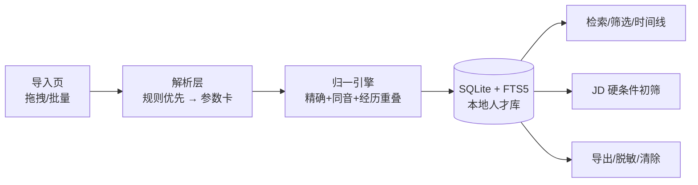

# resume-talent-pool

> 🚧 项目进行中：v0.1.0（M0 骨架 ✅ / M1 合成数据先行 ✅），功能随里程碑点亮（[计划总览](plan/00-README总览.md)）。

**简历解析与人才库管理桌面应用**（Windows，本地优先）：简历批量导入解析 → 本地人才库管理与检索 → 同一候选人多版本简历识别与合并 → JD 硬条件初筛 → 导出。全流程本地运行、零网络上传，把《个人信息保护法》（PIPL，2021-11-01 施行）的合规要求做成可演示的产品功能（默认脱敏显示、一键清除、合规说明页）。

> 免责声明：本工具仅辅助简历整理与筛选定位，不构成录用决策建议。

## 特性（规划，随里程碑点亮）

| 特性 | 状态 |
|---|---|
| 批量导入解析（PDF/docx/txt → 候选人参数卡：字段+置信度+证据） | ⬜ M2 |
| 本地人才库：SQLite + FTS5 全文检索、多维筛选、标签体系 | ⬜ M3 |
| 同一候选人识别与合并（精确键+同音+经历重叠评分，冲突待人工确认） | ⬜ M3–M4 |
| 时间线视图：多版本简历经历演变 | ⬜ M5 |
| JD 硬条件初筛：学历/年限/必备技能/排除项 → 命中矩阵+匹配分（纯规则离线） | ⬜ M3 |
| 隐私合规：默认脱敏显示、一键清除、PIPL 合规页 | ⬜ M5 |
| 内置评测基准：合成简历生成器（固定 seed 带真值，M1 ✅ `bench gen` 一键再生成），指标可复现 | 🔄 M1–M4 |
| PySide6 桌面应用 + PyInstaller 打包 exe | ⬜ M5 |

## 架构



详细设计见 [plan/03-架构与技术选型.md](plan/03-架构与技术选型.md)、[plan/04-模块详设.md](plan/04-模块详设.md)。

## 快速开始（开发态）

```bash
py -m pip install -U pip
pip install -e ".[dev,parse,gen]"
pytest
resume-talent-pool --version
```

- Python ≥ 3.8（开发机 3.8.8）；GUI 需 `pip install -e ".[gui]"`（M5 点亮）。
- 依赖分组见 `pyproject.toml`：`parse`/`gen`/`gui`/`report`/`llm`/`dev`。

## 内置评测基准

（M4 填入：字段解析 F1、同一人识别 P/R、误合并率；合成数据固定 seed 可复现，零 API 依赖。）

## 目录结构

```
src/resume_talent_pool/   核心包（parsing/normalize/screening/storage/privacy/evaluation/gui）
tests/                    离线测试
plan/                     项目计划与交接快照（00–06、HANDOFF）
data/                     数据台账、知识库（PIPL 条文出处）、生成器参数池、入仓样例
```

## 边界与限制

- 输入仅限**文本型** PDF/docx/txt（扫描件图片型不支持，会显式提示）；简历全部为合成数据（人名/手机号/邮箱虚构）。
- 不做：爬取、背景调查、面试评价、录用决策建议；不做云同步与多用户。
- 详见 [plan/02-需求解读.md §4](plan/02-需求解读.md)。

## License

[MIT](LICENSE)
