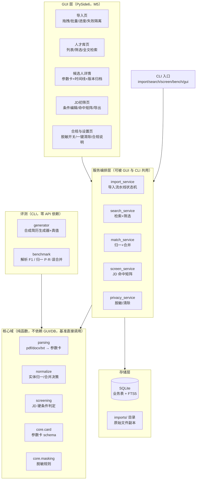

# 03 架构与技术选型

> 定稿 2026-10-05。环境底线（本机实测）：Windows 10+ x64、Python 3.8.8（本机唯一解释器，`requires-python >= 3.8`）、pip 25.0.1、setuptools 75.3.4、sqlite3 3.34.0（FTS5 trigram tokenizer 可用）。

## 1. 总体架构



分层纪律：核心域（parsing/normalize/screening/core）是纯函数库，不 import PySide6、不连数据库——基准脚本直接调用它们，保证评测的就是业务本体；服务层做编排与持久化；GUI 只做展示与交互。

## 2. 技术选型表

| 组件 | 选型 | 许可 | 理由 | 风险与对策 |
|---|---|---|---|---|
| GUI | PySide6 | LGPL-3.0 | Qt 官方绑定，QTableView/拖拽/打包生态成熟 | 6.8 起要求 Python≥3.9 → **pin `<6.8`**，M5 安装实测校准 |
| PDF 文本抽取 | pdfplumber | MIT | 纯 Python、字符级坐标（可做证据定位）、对文本型 PDF 抽取稳 | 新版可能要求≥3.9 → pin `<0.12`，M2 校准 |
| docx 读写 | python-docx | MIT | 简历解析与报告导出共用一套 | — |
| 同音归一 | pypinyin | MIT | 姓名拼音键（全拼+首字母）做同音弱匹配 | 多音字误判 → 仅作弱证据分量 |
| PDF 生成（合成器） | reportlab | BSD | 程序化排版简历 PDF，与 pdfplumber 同源联调 | 中文字体 → 内置 CID 字体或随包分发开源字体（台账登记许可） |
| 存储 | sqlite3 标准库 + FTS5 | 公有领域 | 零依赖、单文件、天然"本地优先" | 中文分词 → **trigram tokenizer**（SQLite≥3.34，本机 3.34.0 ✅），M3 实测定稿 |
| 打包 | PyInstaller | GPL（工具本体，产物不受染） | onedir 模式打 zip | 体积与杀软误报 → onedir 优于 onefile；排除不必要模块 |
| LLM 兜底（可选） | openai 兼容客户端 | — | 仅 P2 加分项，默认关闭，硬条件初筛永不依赖 | 不可达 → 全功能降级规则通路 |
| 测试/CI | pytest + GitHub Actions | — | 四矩阵（ubuntu/windows × 3.8/3.11） | Windows 全挂 = 代码页/路径类问题信号（系列经验） |

## 3. 依赖分组（extras，骨架期即声明）

| 组 | 包 | 用途 |
|---|---|---|
| `parse` | python-docx, pdfplumber, pypinyin | 解析层运行依赖（M2 起随功能提升进 `dependencies`） |
| `gen` | reportlab | 合成简历生成器 |
| `gui` | PySide6 (<6.8) | 桌面界面 |
| `report` | python-docx | 技术报告/导出 docx |
| `llm` | openai | 可选 LLM 兜底 |
| `dev` | pytest | 测试 |

**纪律（系列实测教训）**：extras 必须覆盖运行期与**测试期**真实 import；测试模块用 `pytest.importorskip` 跳过缺失重型依赖时，CI 必须显式安装对应 extras，并对照 dev 与干净环境的 pytest **收集数**，防止静默少跑。骨架期核心 `dependencies = []`（CLI/测试零第三方依赖可跑），M2 合入解析器时把 `parse` 组提升为核心依赖。

## 4. 仓库布局（仓库根 = 包根）

```
resume-talent-pool/            ← GitHub 仓库根
├── src/resume_talent_pool/    ← Python 包（src layout）
│   ├── core/                  # card.py 参数卡 schema、masking.py 脱敏
│   ├── parsing/               # router.py + docx/pdf/txt 解析器
│   ├── normalize/             # matcher.py 归一、merge.py 合并
│   ├── screening/             # jd.py 命中矩阵
│   ├── storage/               # db.py TalentStore（SQLite+FTS5）
│   ├── privacy/               # purge.py 一键清除
│   ├── evaluation/            # generator.py 生成器、benchmark.py 基准
│   ├── gui/                   # app.py PySide6 入口（惰性导入）
│   ├── pipeline.py            # 导入流水线状态机
│   └── cli.py                 # 命令行入口
├── tests/                     # pytest（离线，分批可跑）
├── plan/                      # 本计划目录（入仓）
├── data/                      # 数据台账 + 知识库 + 入仓样例（见 05）
├── pyproject.toml / README.md / LICENSE / .gitattributes / .gitignore
└── .github/workflows/ci.yml
```

原始空目录 `code/` 移除（决策 D-011：仓库根=包根，src layout）。

## 5. 关键数据流

1. **导入解析**：文件（拖拽/扫描）→ sha256 去重 → router 按扩展名分派解析器 → 文本化 → 行规整 → 槽位抽取 → `CandidateCard`（值+置信度+证据）→ 归一引擎判定：新人建档 / 并入既有候选人（版本归档）/ 冲突待人工确认 → 写 SQLite + FTS5。
2. **检索筛选**：FTS5 全文 + 结构化筛选器 → 候选列表（显示层过脱敏开关）。
3. **JD 初筛**：JD 条件 JSON → 逐候选人命中矩阵（hit/miss/insufficient）→ 匹配分排序 → 导出。
4. **清除**：确认对话框 → 清空业务表 + VACUUM + 删除 imports/ 副本 → 合规页回显。

## 6. 打包与分发

- PyInstaller **onedir** + zip 附 GitHub Release（onefile 启动慢、杀软误报率高）。
- 随包数据：合规文案、（如需）开源中文字体文件，`collect_data` 收齐；`/docs` 类无外部 CDN——桌面应用天然 0 外链，但 GUI 内不得引用任何在线资源（断网可演示是红线）。
- 打包冒烟：无 Python 环境机器（或干净目录）运行 exe 走通导入→检索→初筛→清除。

## 7. 环境底线与校准点

- Python 3.8.8 是开发与 CI 下限（本机唯一解释器）；`requires-python = ">=3.8"`。
- 依赖版本 pins 是初值，M2（parse 组）与 M5（gui 组）安装实测后校准，校准结论回写 [06-决策记录.md](06-决策记录.md)。
- 本机开发纪律沿用系列经验：`py -X utf8`、`PYTHONDONTWRITEBYTECODE=1`（含 pip 安装）、测试分批跑、Git Bash `/` 开头参数改写陷阱规避。
